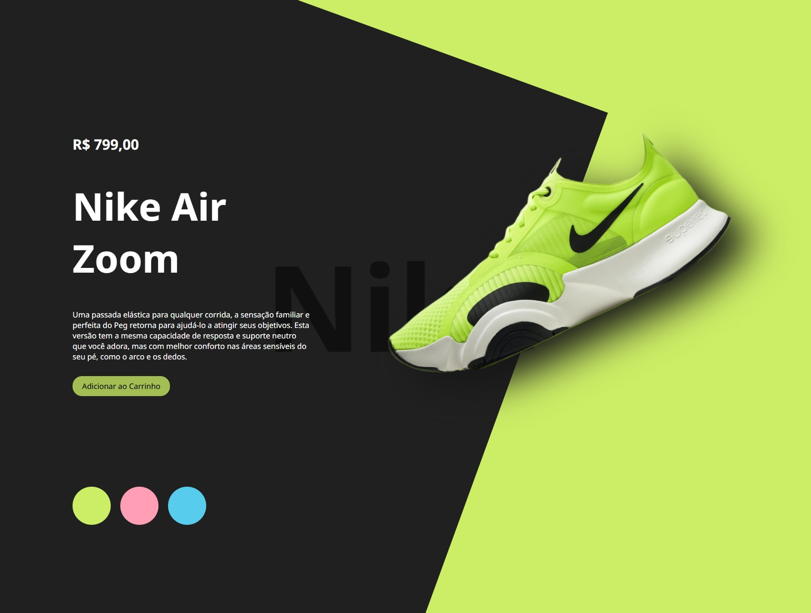

# Nike DevClub - Página de Produto Interativa

## 📋 Descrição

Este é um projeto de página web interativa que apresenta o tênis Nike Air Zoom. Desenvolvido como parte do curso DevClub, o site permite visualizar o produto com diferentes cores e inclui uma interface responsiva e animada. O foco é demonstrar habilidades em HTML, CSS e JavaScript para criar uma experiência de usuário envolvente.

## ✨ Funcionalidades

- **Visualização de Produto**: Exibe informações detalhadas do tênis Nike Air Zoom, incluindo preço, descrição e imagem.
- **Troca de Cores**: Botões interativos que permitem alterar a cor do tênis e o fundo da página dinamicamente.
- **Animações Suaves**: Transições e efeitos visuais para uma experiência fluida.
- **Design Responsivo**: Layout adaptável para diferentes tamanhos de tela.
- **Elementos Visuais**: Fundo com texto "Nike" em grande escala e sombras para destacar o produto.

## 🛠️ Tecnologias Utilizadas

- **HTML5**: Estrutura da página e conteúdo semântico.
- **CSS3**: Estilização avançada, incluindo flexbox, transições, pseudo-elementos (::before e ::after) e responsividade.
- **JavaScript**: Funcionalidade interativa para troca de imagens e cores.
- **Google Fonts**: Fonte "Noto Sans" para uma tipografia moderna.

## 🚀 Instalação e Uso

Este projeto é puramente front-end e não requer instalação de dependências. Basta seguir os passos abaixo:

1. **Clone ou Baixe o Repositório**:
   - Baixe os arquivos do projeto para o seu computador.

2. **Abra o Arquivo**:
   - Navegue até a pasta do projeto.
   - Abra o arquivo `index.html` em qualquer navegador web moderno (Chrome, Firefox, Edge, etc.).

3. **Interaja com a Página**:
   - Clique nos botões coloridos na parte inferior para alterar a cor do tênis e o fundo.
   - Observe as animações e transições suaves.

## 📸 Preview do Projeto



*Captura de tela da página inicial mostrando o tênis Nike Air Zoom com fundo verde.*

## 📁 Estrutura do Projeto

```
Nike/
├── index.html          # Arquivo principal HTML
├── styles.css          # Estilos CSS
├── scripts.js          # Scripts JavaScript
└── img/                # Pasta de imagens
    ├── logo.png        # Logo da Nike
    ├── nike1.png       # Imagem do tênis (verde)
    ├── nike2.png       # Imagem do tênis (azul)
    ├── nike3.png       # Imagem do tênis (rosa)
    └── imagemprojeto.jpg # Preview do projeto
```

## 🎨 Estilos e Design

- **Cores Principais**: Verde (#ccee66), Azul (#58cced), Rosa (#ff9eb5).
- **Layout**: Flexbox para alinhamento responsivo.
- **Efeitos**: Sombras, opacidade e rotações para um visual moderno.
- **Fonte**: Noto Sans para legibilidade.

## 📝 Notas de Desenvolvimento

- O projeto utiliza JavaScript puro para manipulação do DOM.
- As imagens são otimizadas para web.
- O design é inspirado em páginas de e-commerce modernas.

## 👨‍💻 Autor

Desenvolvido como parte do curso. Adaptado e comentado para fins educacionais.

## 📄 Licença

Este projeto é para fins educacionais e não possui licença específica. Sinta-se à vontade para usar e modificar conforme necessário.

---

*Projeto simples e elegante para demonstrar conceitos fundamentais de desenvolvimento web.*